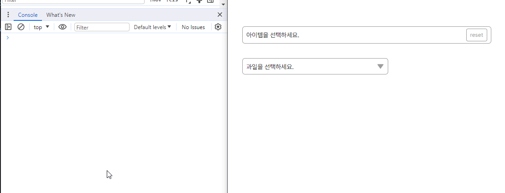
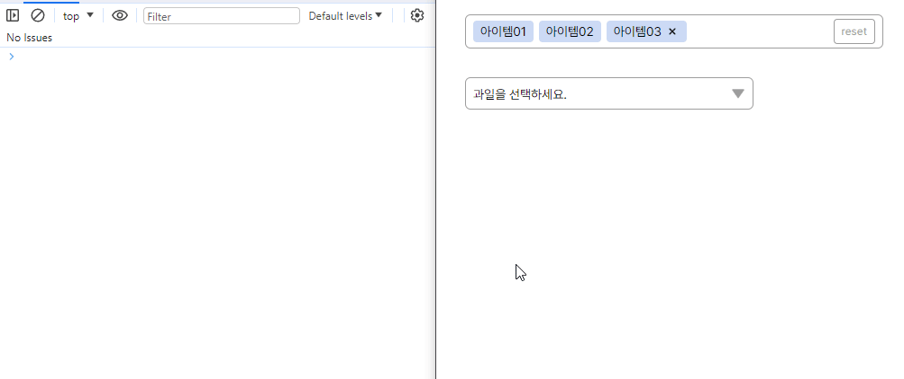
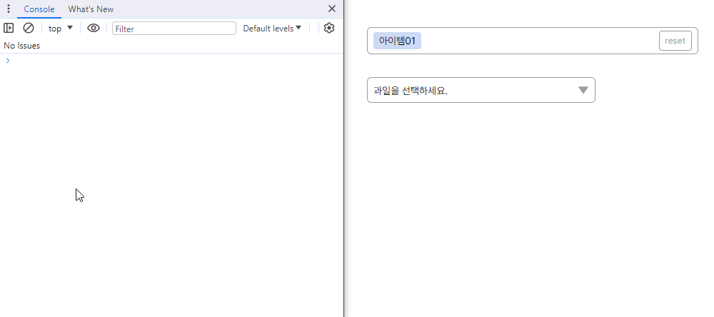
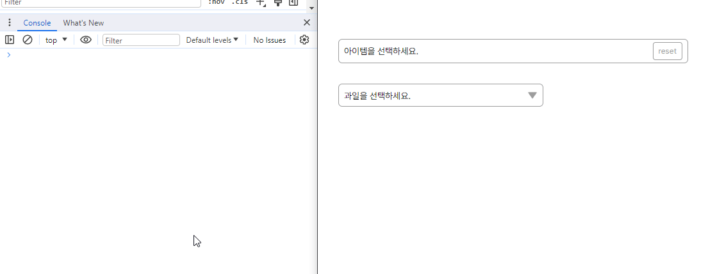

# 커스텀 드롭다운

<select id="customDropdown01">
    <option value="item01">아이템01</option>
    <option value="item02">아이템02</option>
    <option value="item03">아이템03</option>
    <option value="item04">아이템04</option>
    <option value="item05">아이템05</option>
    <option value="item06">아이템06</option>
    <option value="item07">아이템07</option>
</select>
select 태그를 멀티/단일선택이 가능한 커스텀 UI로 변경해주는 기능 
 

 
옵션으로 다중선택여부, 플레이스홀더 문구를 설정하여 드롭다운을 생성할 수 있다.

    const options = {
        multiple : true,
        placeholder : string, 
    }
    const dropdown = new Dropdown('selectId');
    dropdown.init(options);

 
옵션으로 init()시 선택되어있는 값과 수정불가능한 값을 지정해 줄 수 있다. 
수정불가능한 값은 reset()의 영향을 받지않는다.

    const selectedItemList = ['item01', 'item02', 'item03'];
    const options = {
        multiple : true,
        placeholder : string, 
        selectedItem : selectedItemList,
        unmodifiable : ['item01', 'item02']
    }
    const dropdown = new Dropdown('selectId');
    dropdown.init(options);

 
add(), remove()를 사용하여 드롭다운의 선택값을 추가하거나 선택해제 할 수 있다.

    dropdown.add('item01');
    dropdown.add(['item01', 'item02]);
    dropdown.remove('item01');
    dropdown.remove(['item01', 'item02]);

 
다중선택여부를 false로 설정하여 select태그를 커스터마이징한 형태로 생성할 수 있다.

    const options = {
        multiple : false,
        placeholder : String, 
    }
    const dropdown = new Dropdown('selectId');
    dropdown.init(options);

사용할 수 있는 메서드

    dropdown.add();     // 드롭다운의 아이템선택
    dropdown.remove();  // 드롭다운의 아이템선택해제
    dropdown.getData(); // 드롭다운에서 선택되어있는 데이터반환
    dropdown.reset();   // 드롭다운의 선택목록 초기화(수정불가능한 값 제외)
