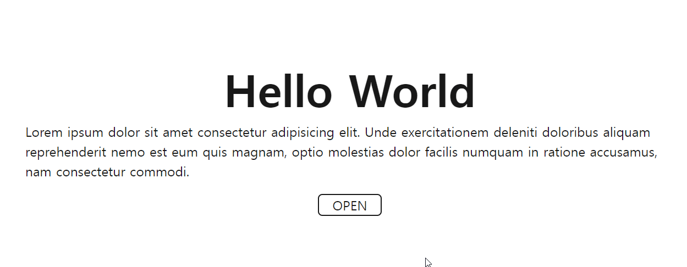

# 모달창만들기

모달창 생성시 화면 중앙에 배치시키기

1. top, left를 50%를 주고, transform으로 -50%씩 이동 
top, left: 50%, transform(-50%, -50%);

2. setProperty를 사용 
setProperty('top', 'calc(50% - '+(modalHeight/2)+'px)') 
setProperty('left', 'calc(50% - '+(modalWidth/2)+'px)')