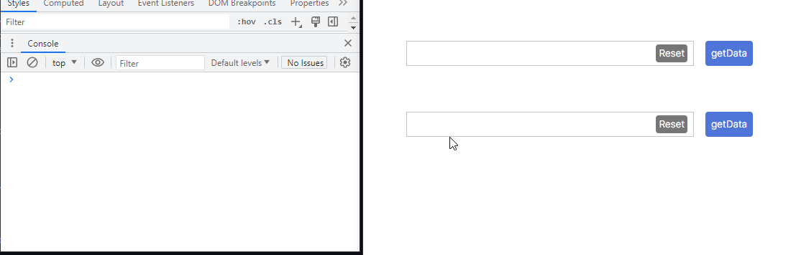

# 여러개의 정보를 칩형태로 추가하거나 삭제할 수 있는 인풋박스

여러개의 정보를 칩형태로 추가, 삭제 및 data를 가져올 수 있는 input box

    multipleInput.init('ID');       // 활성화
    multipleInput.getData('ID');    // 데이터 가져오기
    multipleInput.clear('ID');      // 데이터 초기화
         
