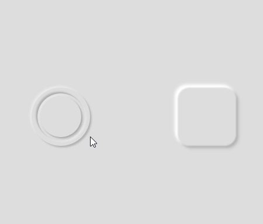

# 뉴모피즘 버튼 #

span태그를 여러개 만들어서 스타일을 주었는데.... 
아래의 사이트처럼 만들면 간편하게 만들수있음.

[UIUX 뉴모피즘(Nuemorphism)에 대하여..](https://blog.naver.com/kosoodream/222442882276)

[뉴모피즘 버튼만드는 사이트](https://neumorphism.io/#d1d1d1)