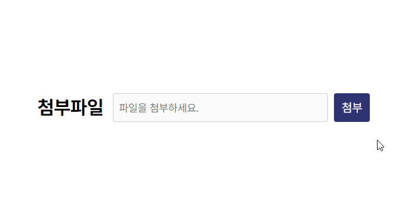

# Custom file upload

    <input type="file"> 커스터마이징

1. 파일을 업로드하기위한 input는 보이지않도록 숨김처리함

2. 파일을 업로드하기위한 input과 label을 연결

3. 업로드한 파일의 텍스트를 보여줄 disabled처리된 input의 value를 숨김처리한 input의 files[0].name으로 변경

4. 파일이 첨부될 시 X버튼이 보여지고, X버튼을 클릭 시 value를 제거함