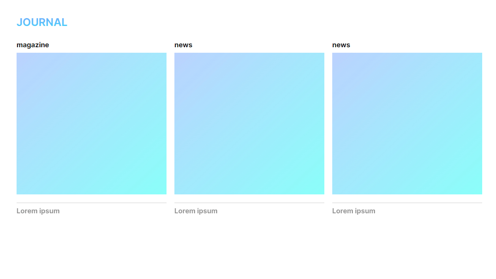

# scaleX()와 transform-origin을 이용한 line animation

transform: scaleX(0), transform-origin: right 를

Hover시 transform: scaleX(1), transform-origin: left 로 변경하여

scaleX가 왼쪽에서 오른쪽으로 늘어났다가 오른쪽에서 왼쪽으로 줄어드는 애니메이션