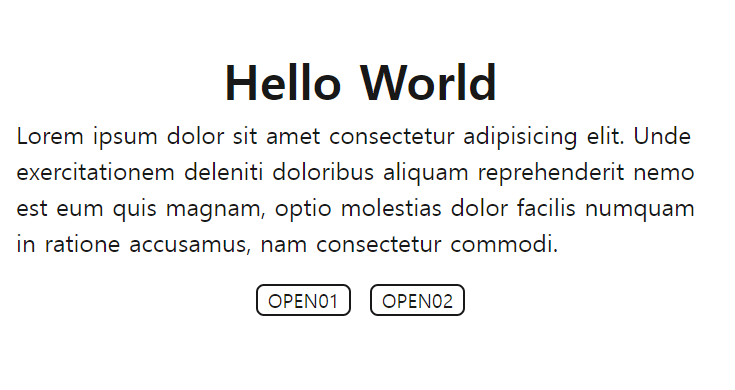

# 모달창만들기

dataAttributes로 모달창 제어하기

1. 모달창을 여는 버튼에 data속성값을 주고 해당 속성값과 동일한 클래스를 가진 선택자를 보여지도록 처리함.

        document.addEventListener('click', (e) => {
            let dataTarget = e.target.getAttribute('data-target');
            let targetModal = document.querySelector('.'+dataTarget);
            
            if (dataTarget != null) {
                modalWrap.style.display = 'block';
                targetModal.setAttribute('style', 'display: block;top: 50%;left: 50%;transform: translate(-50%, -50%);')
            }
        })